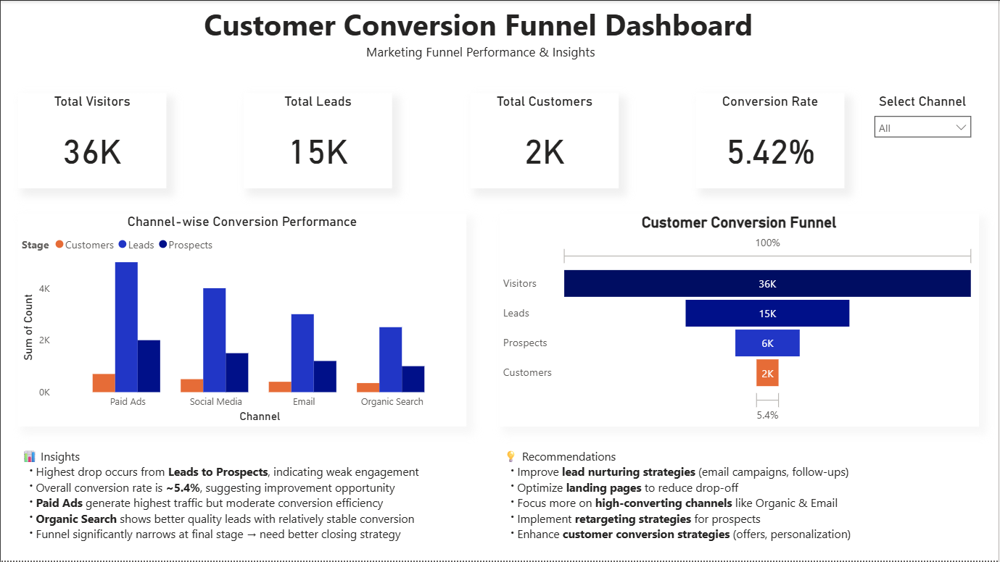

# 📊 FUTURE INTERNS – TASK 03

## Marketing Funnel & Conversion Performance Analysis

---

## 📌 Project Overview

This project focuses on analyzing the **marketing funnel performance** of a business.
The goal is to identify **conversion drop-offs**, evaluate **channel performance**, and provide **actionable recommendations** to improve customer conversion rates.

---

## 🎯 Objectives

* Analyze the customer journey across funnel stages
* Identify major drop-off points
* Evaluate performance across marketing channels
* Improve conversion efficiency using data-driven insights

---

## 🛠 Tools Used

* Power BI
* Data Visualization
* DAX (for KPI calculations)

---

## 📁 Dataset

The dataset includes:

* Funnel Stages: Visitors, Leads, Prospects, Customers
* Marketing Channels: Paid Ads, Social Media, Email, Organic Search
* User Count at each stage

---

## 📊 Dashboard Features

### 🔹 KPI Metrics

* Total Visitors
* Total Leads
* Total Customers
* Conversion Rate

### 🔹 Funnel Visualization

* Displays the flow from Visitors to Customers
* Highlights conversion drop-offs

### 🔹 Channel Performance Analysis

* Compares Leads, Prospects, and Customers across channels

### 🔹 Interactive Filter

* Channel-based slicer for dynamic analysis

### 🔹 Insights & Recommendations

* Key findings and business suggestions included

---

## 📈 Key Insights

* Highest drop occurs between **Leads and Prospects**, indicating weak engagement
* Overall conversion rate is **~5.4%**, showing improvement opportunities
* **Paid Ads generate high traffic** but moderate conversion efficiency
* **Organic Search provides better quality leads** with stable conversions
* Significant drop at final stage suggests need for improved closing strategies

---

## 💡 Recommendations

* Improve **lead nurturing strategies** (email campaigns, follow-ups)
* Optimize **landing pages** to reduce drop-offs
* Focus on **high-performing channels** like Organic & Email
* Implement **retargeting strategies**
* Enhance **conversion techniques** using personalization and offers

---

## 🖼️ Dashboard Preview

---

## 🚀 Conclusion

This dashboard provides valuable insights into marketing funnel performance and helps businesses identify areas to improve conversion rates and customer acquisition strategies.
